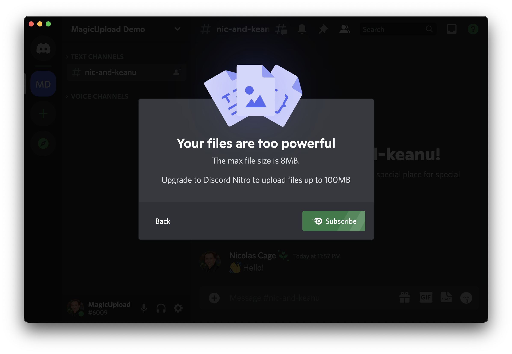
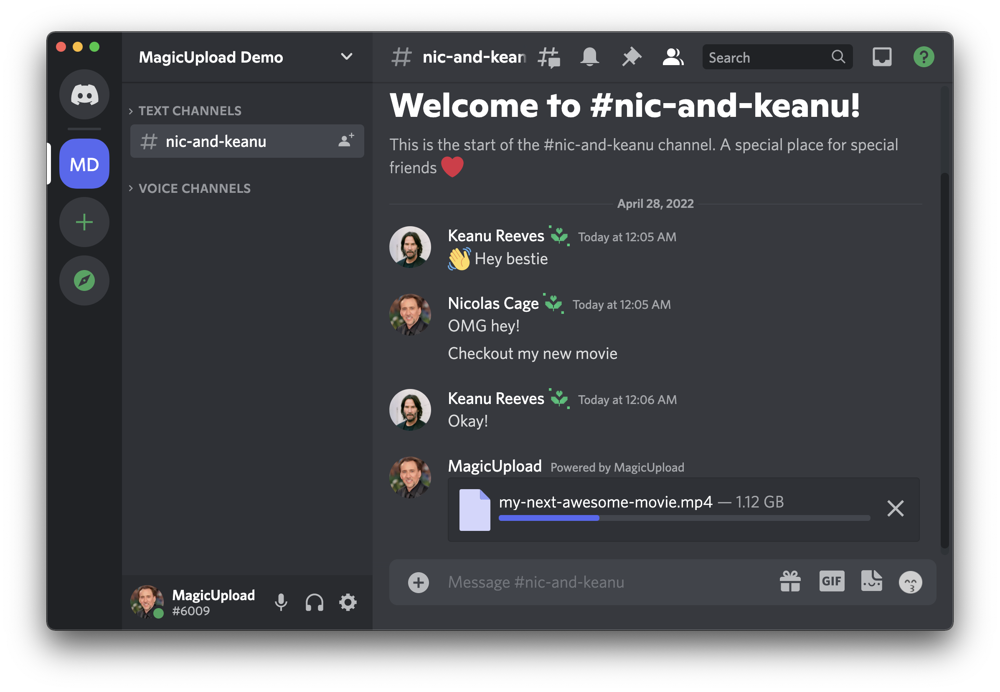
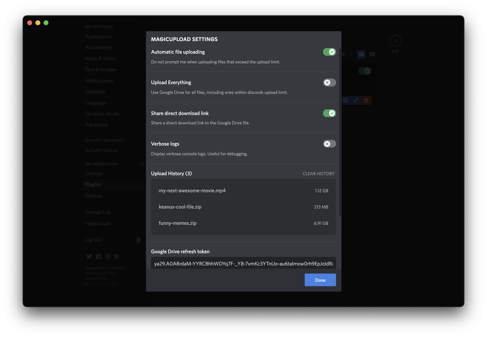
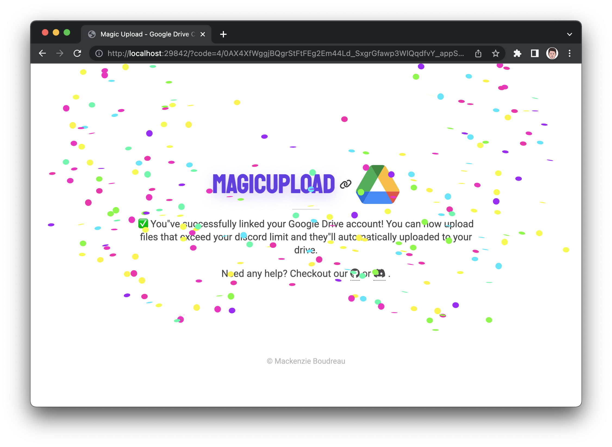

  
# 🧙‍♀️✨ Magic Upload
A BetterDiscord plugin to automagically upload files over 8MB. This plugin works by connecting your Google account and uploading files that exceed Discords limit to Google Drive.

### Before & After Preview
<p float="left">
 
 
</p>

<details>
<summary style="cursor: pointer;"><b>More screenshots</b></summary>
<p float="left">
 
 
</p>
</details>

## Getting Started
1. Download & install [BetterDiscord](https://betterdiscord.app).
2. Copy [MagicUpload.plugin.js](MagicUpload.plugin.js) into your BetterDiscord plugins folder.
    1. Where is my plugins folder? Click [here](#install).
3. Enable the plugin and click on `Connect Google Account` from the popup.
    1. How do I enable the plugin? Go to Settings > Plugins and make sure MagicUpload is switch on.
    2. Will you have access to my Google Drive? No! Your Google Drive credentials are stored on your computer, and **your computer only**.
4. 🎉 Start uploading large files!

## Contributing
To get started contributing, clone the repository and run:
```
$ make watch
```
You will then be able to make changes to `index.js` and on save the plugin will be built and installed. For changes to the HTML templates used in OAuth, see the templates [README.md](templates).

#### Makefile Commands
```
build                          Build a minified bundled version of the plugin.
install                        Copy release to BetterDiscord plugin directory.
setup                          Install tools used to build and hot reload plugin.
watch                          Automatically build and install plugin on save.
```

## Frequently Asked Questions
<h3 id="install">How do I install a BetterDiscord plugin?</h3>

To install a BetterDiscord plugin, you'll need to have BetterDiscord installed and navigate to `Settings` > `Plugins` in Discord. From there you'll be able to click on `Open Plugins Folder`. Then all you have to do is add the file `MagicUpload.plugin.js` into your plugins folder.

<h3 id="security">Will anyone have access to my Google Drive?</h3>

<b>Nope!</b> When you sign in with Google, an http server is started in the background that server listens for the response from Google. Meaning that there is no middleman intercepting your OAuth tokens. They are stored locally on your computer only and as an added layer of protection, encrypted before being stored on disk.
<br>
<br>
However nothing is 100% secure, so if you feel like your tokens are ever comprimised, please <a href="https://support.google.com/accounts/answer/3466521?hl=en">remove the application</a> from your 3rd party applications ASAP.

## Special Thanks ❤️
- [@dftd](https://github.com/dftd) for providing feedback & beta testing.
- [@SirArya](https://github.com/SirArya) for providing feedback & beta testing.
- [@sterrio](https://github.com/sterrio) for providing feedback & beta testing.